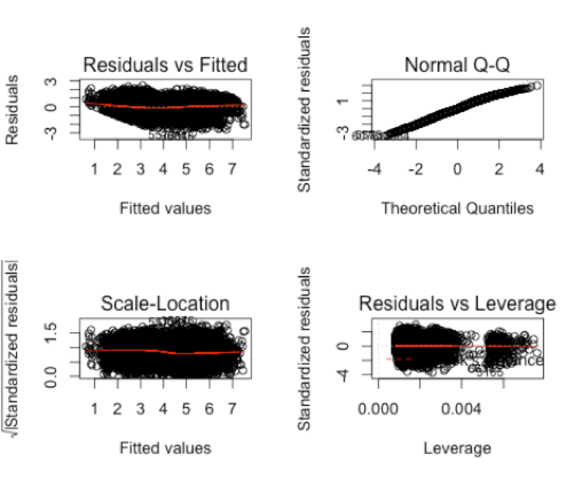
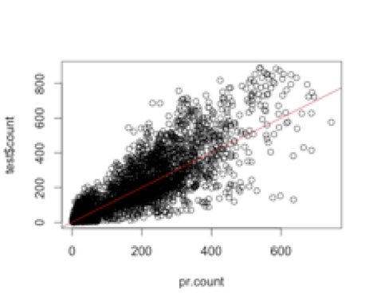

MBD – Linear regresion problem -ML

**Descripción **

Los sistemas de alquiler de bicicletas existentes en las grandes
ciudades disponen de un sistema automatizado de recogida y retorno del
vehículo a través de una red dee staciones distribuidas por toda la
metrópolis. Con el uso de estos sistemas, las personas pueden alquilar
una bici en una ubicación y retornarla eno tra distinta enfunción de sus
necesidades. Los datos generados por estos sistemas son atractivos para
los investigadores debido a variables como la duración del viaje, los
puntos de salida y destino y el tiempo de trayecto. Por tanto, los
sistemas de intercambio de bicicletas funcionan comouna red de sensors
que son útiles para los estudios de movilidad. Con el objetivo de
mejorar la gestión, una de estas empresas necesita anticiparse a la
demanda que habrá en un determinado rango de tiempo en función de
factores como la franja horaria, el tipo de día (laborable o festivo),
la climatología, etc..

**El objetivo de esta problema es predecir la demanda en una serie de
franjas horarias concretas, usando el conjunto de datos histórico como
base para construir un modelo lineal. **

**Datos **

Dos conjuntos de datos que contendrán el número de bicicletas alquiladas
en distintas franjas de una hora:

1\. Datos de entrenamiento. Contendrán la variable respuesta (número de
bicicletas alquiladas en esa franja)

2\. Datos test. No contendrán la variable respuesta y ésta deberá
predecirse basándose en los datos históricos del conjunto de
entrenamiento.

Las variables presentes en los conjuntos de datos son:


-   **id:** identificador de la franja horaria (no guarda relación con
    el orden temporal)


-   **year:** año (2011 o 2012)


-   **hour:** hora del día (0 a 23)


-   **season:** 1 = invierno, 2 =primavera, 3 = verano, 4 = otoño


-   **holiday:** si el día era festivo


-   **workingday:** si el día era laborable (ni festivo ni fin de
    semana)


-   **weather:** cuatro categorías (1 a 4) que van de mejora peor
    tiempo


-   **temp:** temperatura en grados celsius
atemp: sensación de
    temperatura en grados Celsius

-   **humidity**: humedad relativa


-   **windspeed**: velocidad del viento (km/h)


-   **count** (sólo en el conjunto de entrenamiento): número total de
    alquileres en esa franja

**Parte 1. Construir modelo **

Dividimos los datos disponibles en una parte para entrenar el modelo y
otra mas pequeña para testear si el modelo predice bien. Empezamos
corgando los datos de entrenamiento para construer el modelo de
predicción.

**1.Borra todos los objetos que tengas en memoria**

rm(list=ls())

**2.Leemos los datos los datos p1\_train.csv**

datos2 \<- read.csv('p1\_train.csv', sep=";") \# leer datos

**3. Visualizamos los 1000 primeros datos, hacemos una desciptiva par
aver en que valores oscilan las variables y eliminamos la variable id**

View(head(datos2,1000)) \# Ver los primeros registros

summary(datos2) \# Descriptiva de todas las variables

datos2\$id \<- NULL \# Elimino la variable id que no se hara servir

**4. Conviertimos las 5 variables que no sean numericas a factores**

datos2\$year \<- factor(datos2\$year)

datos2\$season \<- factor(datos2\$season)

datos2\$workingday \<- factor(datos2\$workingday)

datos2\$holiday \<- factor(datos2\$holiday)

datos2\$weather \<- factor(datos2\$weather)

**5. Conviertimos la hora en un factor
discretizandola en categorias. Imprimimos un grafico que nos ayudara a
seleccionar los intervalos**

plot(count\~hour,datos2)

lines(lowess(datos2\$count\~datos2\$hour,f=1/8),col=2)

He implementado 3 propuestas . En este caso la propuesta "A" parece que
es la mas apropiada de todas ellas.

**A): dividir las horas entre intervalos (HA PROBADO SER LA QUE MEJOR
EQML OBTIENE):** Hora Punta, Hora Baja, Madrugada. Notese que las 08h se
ha incluido en hora Punta, debido ha que al realizar el boxplot sus
valores salian por ariba del 3r quartil-valores extremos (en caso de ser
considerados en "HoraBaja"),

**B) Dividir las horas en 4 intervalos (LA QUE MEJOR R2 Y EQML
OBTIENE)**: HoraPunta, HoraMedia, HoraBaja, Madrugada. En este caso el
EQM sale menor (80 i algo) , pero el EQML sale ligeramente superior.

**C) Esta opcion considerar como Hora punta solo 18-18h (**HoraPunta,
HoraBaja y Madrugada). Es ligeramente peor que la opcion A.

\#Variable (switch) para cambiar de opción al definer los intervalos
horarios y hacer diferentes tests.

optionHourInterval \<- "A"

**\#OPTION A (4 intervals)**

if(optionHourInterval == "A" )

{ datos2\$hour2 \<- ifelse(datos2\$hour %in% 17:18 | datos2\$hour == 8
,"HoraPunta",

ifelse(datos2\$hour %in% 7:22,"HoraBaja","Madrugada")) }

**\#OPTION B (4 intervals)**

if(optionHourInterval == "B")

{ datos2\$hour2 \<- ifelse(datos2\$hour %in% 17:18 | datos2\$hour == 8
,"HoraPunta",

ifelse(datos2\$hour %in% 12:16 | datos2\$hour == 19,"HoraMedia",

ifelse(datos2\$hour %in% 7:22,"HoraBaja","Madrugada"))) }

**\#OPTION C (default)**

if(optionHourInterval == "C" )

{ datos2\$hour2 \<- ifelse(datos2\$hour %in% 17:18 ,"HoraPunta",

ifelse(datos2\$hour %in% 7:22,"HoraBaja","Madrugada"))

}

Una vez hemos definido los inervalos, indicar que la nueva variable es
un factor.

datos2\$hour2\<- factor(datos2\$hour2)

datos2\$hour \<- NULL

 Imprimir box plot, util para observer como se
clasifican los intervalos, con los cuartiles, valores extremos y las
medias.

plot(datos2\$hour2,datos2\$count)

**6.Descriptiva para todos los pares de variables. El objetivo es
averiguar si las variables estan relaciondas entre si (nos dan la misma
información), así pues si podemos considerar eliminar una de las
variables.**

par(mfrow=c(1,1)) \# Una sola ventana grafica

pairs(datos2) \# Grafico de todos los pares a la vez (paciencia)

**7. Eliminar variables correlacionadas**

Hay 2 variables muy correlacionadas viendo el anterior grafico. Vemos
que "temp" y "atemp" estan relacionadas linearmente.

El analisis del modelo con solo estas variables independientemente nos
es de probecho para decidir que la variable "temp" generara un mejor
modelo, R\^2 superior (mod.lm.simple1).

  ----------------------------------------------------------------------------------------
  mod.lm.simple1 \<- lm(count\~temp,datos2)   mod.lm.simple2 \<- lm(count\~atemp,datos2)
                                              
  summary(mod.lm.simple1)                     summary(mod.lm.simple2)
                                              
  **Multiple R-squared: 0.1578**              **Multiple R-squared: 0.1537**
  ------------------------------------------- --------------------------------------------
  ----------------------------------------------------------------------------------------

Eliminar atempt

datos2\$atemp \<- NULL

**8. Diagrama bivariante con la respuesta (count) de las 3 variables
numuricas que te quedan**

par(mfrow=c(1,3))

**temperatura** - \> relacion lineal ascendente.

**Interpretacion**: A mas temperatura, mayor es count (mas bicicletas)

plot(count\~temp,datos2)

with(datos2,lines(lowess(count\~temp),col=2))

\_\_\_\_\_\_\_\_\_\_\_\_\_\_\_\_\_\_\_\_\_\_\_\_\_\_\_\_\_\_\_\_\_\_\_\_

**humedad** -\> relacion lineal descendiente.

**Interpretacion**: A mas humedad, menos bicicletas

plot(count\~humidity,datos2)

with(datos2,lines(lowess(count\~humidity),col=2))

\_\_\_\_\_\_\_\_\_\_\_\_\_\_\_\_\_\_\_\_\_\_\_\_\_\_\_\_\_\_\_\_\_\_\_\_

**viento** -\> relacion-\> parece una parabloa (aunque tambien se podria
asemejar al logaritmo)

plot(count\~windspeed,datos2)

with(datos2,lines(lowess(count\~windspeed),col=2))

**8b. boxplots bivariantes con la respuesta (count) y las variables
categoricas (factores). Nos ayudan a entender en que categoria en las
que hemos clasificado los datos se cogen mas bicicletas: **

i.e: mas bicicletas en 2012 que en 2011. Menos
bicicletas en las estaciones frias.

par(mfrow=c(2,3))

boxplot(count\~year,datos2,main="year")

boxplot(count\~season,datos2,main="season")

boxplot(count\~holiday,datos2,main="holiday")

boxplot(count\~workingday,datos2,main="workingday")

boxplot(count\~weather,datos2,main="weather")

boxplot(count\~hour2,datos2,main="hour2")

**9. Ajustar el modelo con todas las variables e interpretar la salida
de resultados**

mod.lm0 \<- lm(count\~.,datos2)

summary(mod.lm0)

**Interpretacion:** con todas las variables el model explica un 64% de
la variabilidad.

Ademas parece ser que "workingday = 1" no es relevante.

**Interpretacion de los coeficientes:** el coeficiente asociada a cada
variable explica que la variable a predecir (count) se incrementa en lo
que indica cada coeficiente de cada variable al incrementar la variable
(del coeficiente) en una unidad.

Por ejemplo, por cada unidad de increment en “temp”, “count” incrementa
en 6.4

**10. Seleccion automatic con step**

mod.lm1 \<- step(mod.lm0)

summary(mod.lm1)

Obtenemos los siguientes Parametros en el modelo: coef(mod.lm1)

**11. Colinealidad**

No hay que eliminar ninguna variable. un VIF mas elevado indica
correlacion (\>5) por lo que deberia ser eliminada. En este caso no hay
ninguna variable con VIF \>5. En todo caso podriamos eliminar "season".
"season" y "temp" tienen un VIF \>3

install.packages('car')

library(car)

vif(mod.lm1)

**12. validacion con el analisis de residuos.** Se
cumplen las premisas? *Discutible que Homogeneidad y normalidad se
cumplan*

par(mfrow=c(2,2))

plot(mod.lm1)

**13. Transformacion de boxCox para la variable respuesta **

Escoger el valor de lambda que maximiza la funcion y aplicala a la
respuesta (count). Probar tambien la transformacion logaritmica

par(mfrow=c(1 , 1))

bc \<- boxCox(mod.lm1)

bc

\# Escoger lambda que maximize la funcion

lambda \<- bc\$x[which.max(bc\$y)]

\# Transformaciones en la respuesta

datos2\$sqcount \<- datos2\$count\^lambda

datos2\$lgcount \<- log(datos2\$count)

***\# Nuevos modelos con respuestas transformadas***

**14. Ajustamos los modelos con las nuevas respuestas , comparer los R2
para saber cual predice major (mod.lm2 -\>major)**

**15. Hacemos la validacion para el modelo anterior
que prediga mejor**

par(mfrow=c(2,2))

plot(mod.lm2)

-   **Normalidad**: (Normal Q-Q) residuos se ajustan a la recta normal.

-   **Homogeneidad**: (Residuals vs fitted) parece que ha mejorado
    respecto al anterior modelo sobretodo en la parte superior.

-   **Linealidad**: (Residuals vs fitted) se cumple. Residuos se
    alrededor del cero distribuidos uniformemnte , linea casi recta.

-   **Independencia**: No se observa evidencia de ningun patron.

**16. Mirar si alguna de las variables numericas
se podra ajustar por una parabola o polinomio**

**17. Ajustamos un polinomio para la que mas creeamos que se asemeja a
una parabola, en este caso la 3a.**

mod.lm4 \<-
lm(sqcount\~year+season+holiday+weather+temp+humidity+poly(windspeed,2)+hour2,datos2)

summary(mod.lm4)

\# Validacion

**par(mfrow=c(2,2)) **

**plot(mod.lm4)**

**18. Eleminar observaciones influyentes. Mirar la
distancia de cook para todas las observaciones. Aquellas que tengan la
distancia de cook mayor, son mas influyentes. Eliminalar las 3 primeras
si se cree necesario y ajustar el modelo sin estas observaciones**

par(mfrow=c(1,1))

cd \<- cooks.distance(mod.lm4)

plot(cd,type='l')

inf \<- sort(cd,decreasing=TRUE)[1:3] \# 3 observaciones mas influyentes

inf

3185 6185 6737

0.005014753 0.003103801 0.002953548

if(optionHourInterval == "A"){

datos3 \<- datos2[-c(3185,6185,6737),]

}

if(optionHourInterval == "B"){

datos3 \<- datos2[-c(3185,6185,7576),]

}

if(optionHourInterval == "C" ){

datos3 \<- datos2[-c(3185,6737,2005),]

}

**Parte 2. Testear resultados**

Cargamos los datos que hemos reservado para testear la fiabilidad del
modelo (test) con el objetivo de averigruar una aproximacion del error
que tenemos en el modelo al predecir.

test \<- read.table('p1\_test (con respuesta).csv',header=TRUE,sep=';')

test\$id \<- NULL \# Elimino la variable id que no se hara servir

test\$atemp \<- NULL

**19. Mismas transformaciones que hiciesto en el conjunto de
entrenamiento**

test\$year \<- as.factor(test\$year)

test\$season \<- as.factor(test\$season)

test\$holiday \<- as.factor(test\$holiday)

test\$workingday \<- as.factor(test\$workingday)

test\$weather \<- as.factor(test\$weather)

\#transformar hora

\#\#--Transformaciones en la respuesta

test\$sqcount \<- test\$count\^lambda

test\$lgcount \<- log(test\$count)

**\# 20. Calcular predicciones y compararlas con
valores reales con predict.** Obtener las predicciones en la muestra
test. Comparalas con los valores reales

pr \<- predict(mod.lm5,test)

plot(pr,test\$sqcount)

abline(0,1,col=2)

**\#\#-- Variable sin transformar**

pr.count \<- exp(log(pr)/lambda)

plot(pr.count,test\$count)

abline(0,1,col=2)

**\#\#-- R2** en el modelo testeado -\> **Multiple R-squared: 0.7462**

mod.lm.test \<-
lm(sqcount\~year+season+holiday+weather+temp+poly(windspeed,2)+humidity+hour2,test)

summary(mod.lm.test)

**\# Errores de prediccion (EQM)**

n \<- dim(test)[1]

EQM \<- sum((pr.count-test\$count)\^2)/n

sqrt(EQM) - \> **RESULT : 100.8061**

**\#\#--Error evaluable en la practica**

EQML \<- sum((log(pr+1)-log(test\$sqcount+1))\^2)/n

sqrt(EQML) -\> **RESULT: 0.1835185**

Para finalizar comparamos los resultados obtenidos en cada una de las
opciones de divider las horas en intervalos explicadas arriba:

**A ) Opción elegida y ejecutada en este documento (3 intervalos,
incluyendo como hora punta 8h):**

  **EQM= 100.8061**   **EQML = 0.1835185**   **Multiple R-squared: 0.7462**
  ------------------- ---------------------- --------------------------------

**B) Opción elegida y ejecutada en este document (4 intervalos definida
arriba):**

  **EQM= 98.74427**   **EQML = 0.2159245**   **Multiple R-squared: 0.7513**
  ------------------- ---------------------- --------------------------------

**C ) Opción elegida y ejecutada en este document (3 intervalos
propuesta por defecto):**

  EQM= 106.6253   EQML = 0.1850785   Multiple R-squared: 0.7352
  --------------- ------------------ ----------------------------

Notese que solo hay que cambiar la variable “optionHourInterval” en el
script para ejecutar el modelo y la predicción para uno de estos 3
casos.

**La option (B**) tiene major **R2: 0.7562** y **major EQM: 98.74** que
la opcion (A). En cambio la opcion (A) tiene major **EQML: 0.1835** que
la opción (B) con **EQML: 0.2158**

**Parte 3. Fichero txt con columnas “identicador franja horaria” y
“numero de alquileres” en esa franja horaria.**

df\_result \<- data.frame(FranjaHoraria = test\$hour2,
Num\_alquiler\_bicis=pr.count)

plot(df\_result)

write.table(df\_result,file="FernandoFerri\_results.txt",sep=",")

**\**Opcion A, 3 intervalos)* **

***\*Opcion B , 4 intervalos***

Es discutible que esta opción no sea la major, ya que obtiene major R2 y
major EQM (pero no major EQML, por eso he presentado los resultados de
la opción A). Tampoco combiene realizer muchos intervalos.

Además la opción B no presenta puntos anomalos fuera de los cuartiles.

